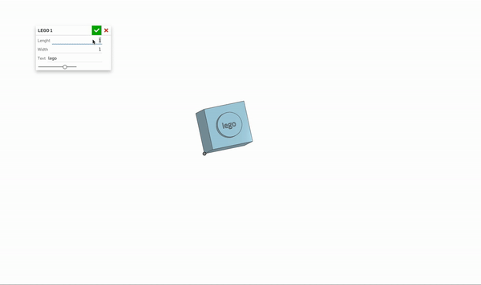
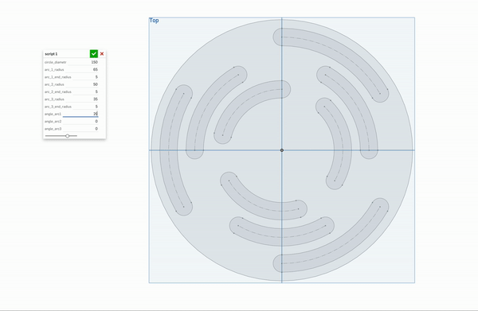

# Onshape

For 1 week i was doing 3D modeling based on "Onshape" software system.
On my opinion this software is easy to use. You will need only couple hours to understand basics and start creating your own details.

For this week i have learned not only how to create 3D details and also make my own features using FeatureScript.
It is relatively new language, so some tools that i used in "hand mode" are absent. That why i needed to find another ways to solve task or use existing functions. 

You can see my code in attached .txt files

